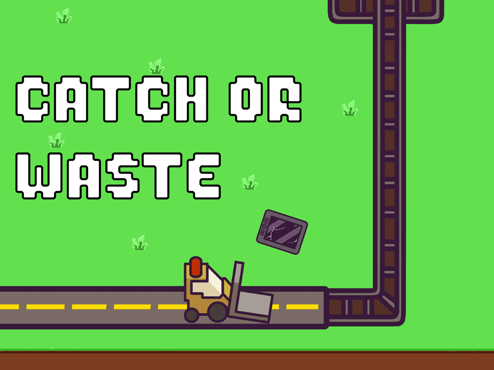
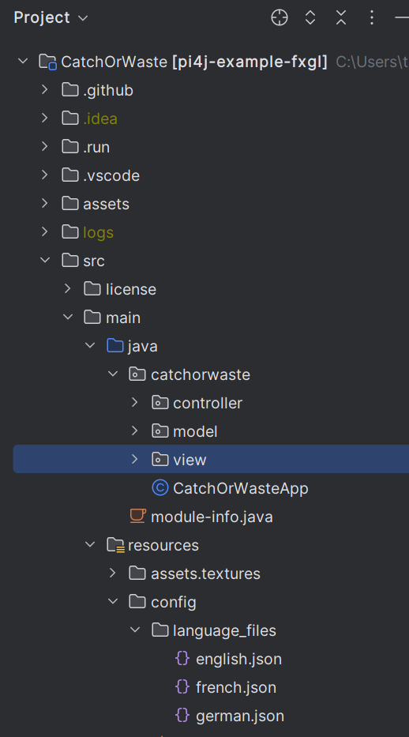
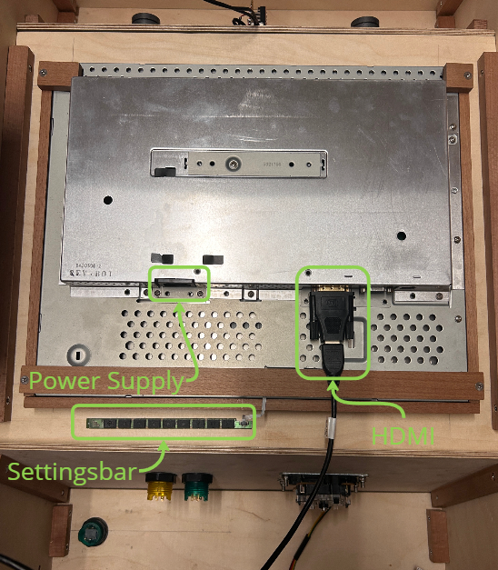
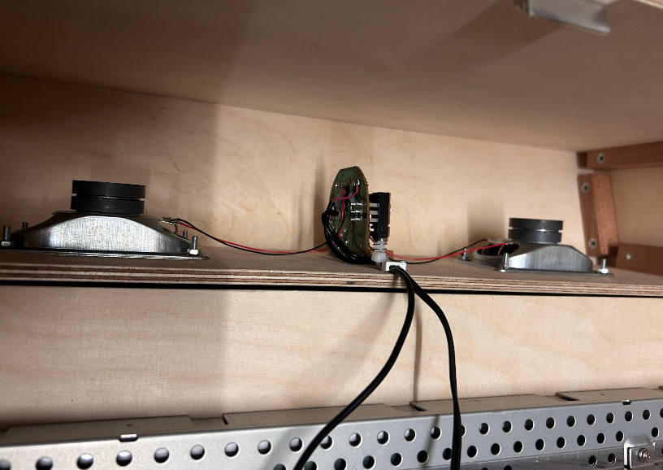
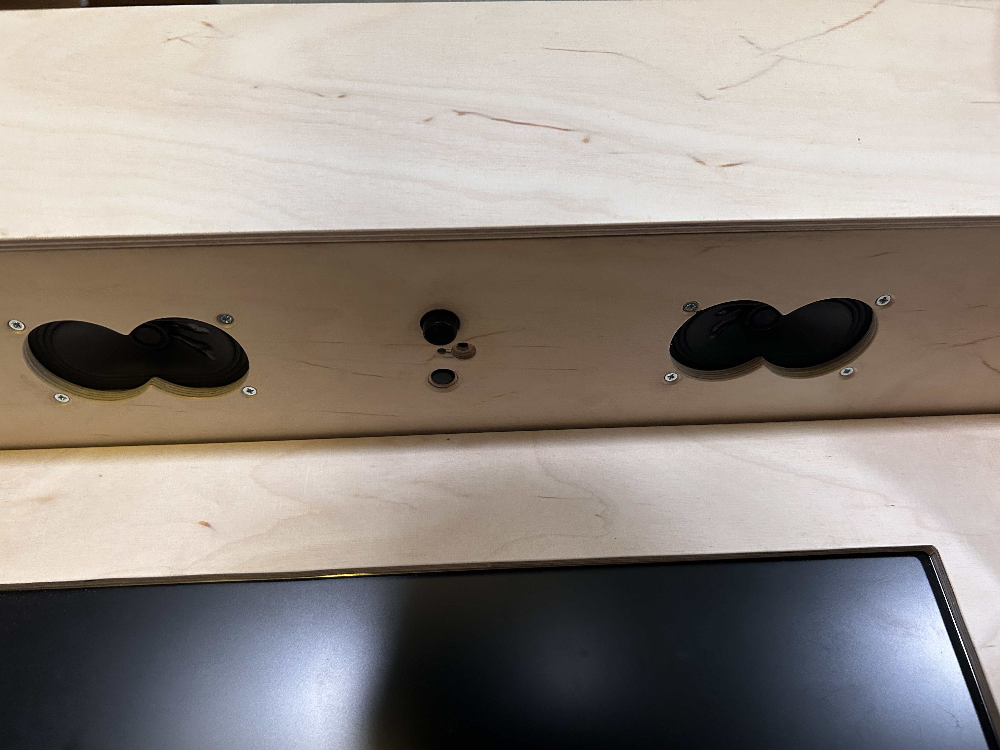
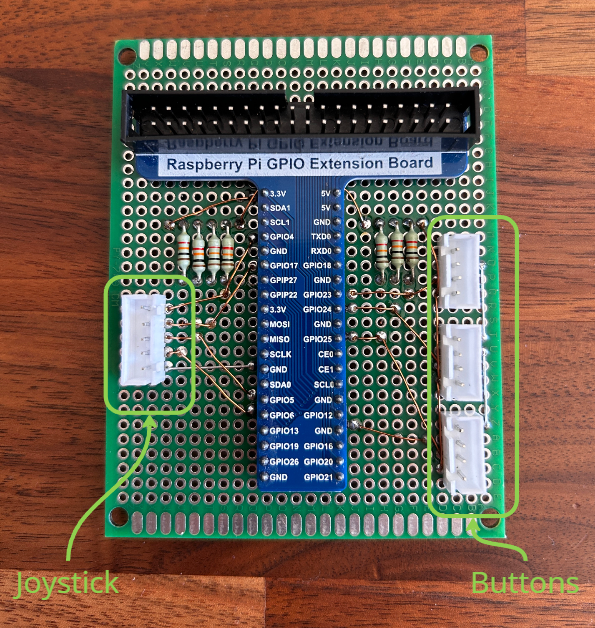
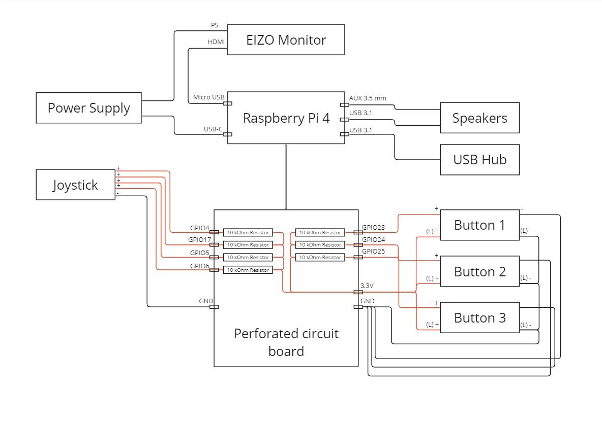
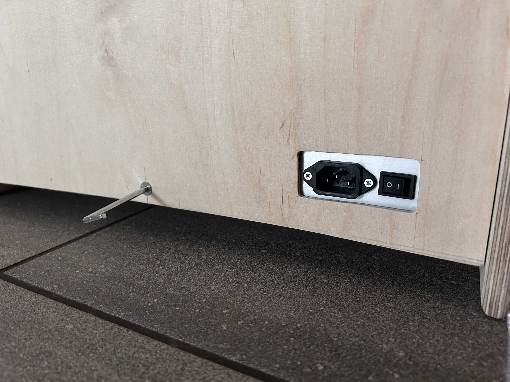

# CatchOrWaste: Java Game Application for Raspberry Pi Using FXGL

[](https://github.com/Pi4J/pi4j-example-fxgl/actions/workflows/maven.yml)



## Table of Contents

- [Project Overview](#project-overview)
- [Runtime Dependencies](#runtime-dependencies)
- [Build Dependencies & Instructions](#build-dependencies--instructions)
- [Setup new RaspberryPi](#setup-new-raspberrypi)
- [Run on RaspberryPi](#run-on-raspberrypi)
- [Game modifications](#game-modifications)
- [Hardware](#hardware)
- [License](#license)

## Project Overview

This game was developed as part of a project at the University of Northwestern Switzerland ([FHNW](https://www.fhnw.ch/de/)) for the energy company [Primeo](https://www.primeo-energie.ch/privatkunden.html). It is an arcade game programmed in Java aimed at educating children and young people about the throwaway society.


## Runtime Dependencies

This project uses Pi4J V.2 which requires the following runtime dependencies:

- [**SLF4J (API)**](https://www.slf4j.org/)
- [**SLF4J-SIMPLE**](https://www.slf4j.org/)
- [**PIGPIO Library**](http://abyz.me.uk/rpi/pigpio) (for the Raspberry Pi) - This library is pre-installed on recent Raspbian images, but can also be manually installed using the instructions found [here](http://abyz.me.uk/rpi/pigpio/download.html).

This application also utilizes a JavaFX user interface, fully detailed in the [User Interface with JavaFX](https://v2.pi4j.com/getting-started/user-interface-with-javafx/) documentation.

## Build Dependencies & Instructions

To build this project, you need [Apache Maven](https://maven.apache.org/) 3.6 or later and Java 11 OpenJDK or later. Ensure these prerequisites are installed before proceeding. The following Maven command will clean previous builds and package the project:

```
mvn package clean
```

## Setup new RaspberryPi
To set up a new RaspberryPi follow this guide: [Pi4J setup new RaspberryPi](https://pi4j.com/getting-started/set-up-a-new-raspberry-pi/)
- Set the resolution of the Monitor in the monitors.xml file to 800x600 for optimal performance and fullscreen


## Install on RaspberryPi
The Game is pre-installed on the Pi. However, if you need to re-install the game, follow these instructions:

### Install via Run Configuration

You'll need:
- Java IDE (like intelliJ)
- Network connection

Ensure your local machine is connected to the same network as your Raspberry Pi then follow these steps:

1. Configure the IP address in the [pom.xml](pom.xml) file.
2. Select the [Run on Pi.run.xml](.run%2FRun%20on%20Pi.run.xml) run configuration.
3. Execute the configuration. Upon a successful build, the new code will be transferred to the Pi (`/home/pi4j/deploy`) and the scripts will execute automatically, replacing any old project in this directory and setting up the service.

### Install Manually
Copy the compiled code to your Raspberry Pi to `/home/pi4j/deploy`.

To manually run the application on the Raspberry Pi run the [start-app.sh](src%2Fmain%2Fresources%2Fscripts%2Fstart-app.sh) script:
```
sudo ./start-app.sh
```

To enable the application to start automatically after a boot or reboot run the [install-service.sh](src%2Fmain%2Fresources%2Fscripts%2Finstall-service.sh) script:
```
sudo ./install-service.sh
```

## Game modifications

There are multiple things that can be configured via a configuration file.
### Language
Languages can be configured by the user via the options screen. This changes all text labels within all screens. The new language is applied as soon as the submit button at the end of the setting screen is pressed. 


If a maintainer wants to add a new Language, he needs to follow the structure of the csv files located under src/main/resources/language_files/ and add a new csv file with the translation of the german.csv in the required language.

As an additional step, visuals in the SettingsView.class and the logic for selecting the right label (SettingsModel.class) have to be modified.

### Learning Messages
To add or modify existing learning messages, a maintainer can edit these in the csv files in the folder src/main/resources/language_files/. It should be noted that there is no automatic translation between the csv files and therefore all languages have to be modified the same way. 




## Hardware

[Dimension Plan](assets%2Fpdf%2Fdimension_plan_arcade_box.pdf)


### Components

| Component                                   | Count | Technical Sheet                                                                           |
|---------------------------------------------|-------|-------------------------------------------------------------------------------------------|
| Arcade Joystick, 8 Ways, 65,3mm hight, red  | 1     | [Technical sheet](assets%2Fpdf%2FArcade-Joystick-8-Wege-65-3mm-Hoehe-rot.pdf)             |
| Arcade Button, 30mm, LED 5V DC, transparent | 3     | [Technical sheet](assets%2Fpdf%2FArcade-Button-30mm-beleuchtet-LED-5V-DC-transparent.pdf) |
| EIZO FlexScan 19” (48cm)                    | 1     | [Technical sheet](assets%2Fpdf%2Feizo_l768_datenblatt.pdf)                                |
| Raspberry Pi                                | 1     | [Technical sheet](assets%2Fpdf%2Fraspberry-pi-4-reduced-schematics.pdf)                   |


#### Monitor
- Removed from original housing and integrated to box
- Settingsbar attached inside the box
- Connected via HDMI to Raspberry Pi
- Power supply connected from main power supply



#### Speakers
- Removed from original housing and integrated to box
- Connected via stereo audio aux 3.5 mm to Raspberry Pi
- Power supply connected to Raspberry Pi (USB 3.1)
- The volume can be changed at the front of the box or headphones can be plugged in

  
  

#### Joystick & Buttons (input)
- Are connected via perforated circuit board to Raspberry Pi
- 10 kOhm resistance between each GPIO input and 3.3V+ 
- Perforated circuit board connected to Raspberry Pi with flat multi cable



### Wiring



### Modifications

- Make sure the box is not powered when making any changes to the hardware. 
- Simply unscrew the three screws of the back to open it




## License

This project is licensed under the Apache License, Version 2.0. You may not use this file except in compliance with the License, which you can find at:
http://www.apache.org/licenses/LICENSE-2.0

Software distributed under the License is distributed on an "AS IS" BASIS, WITHOUT WARRANTIES OR CONDITIONS OF ANY KIND, either express or implied. Refer to the License for the specific language governing permissions and limitations under the License.
