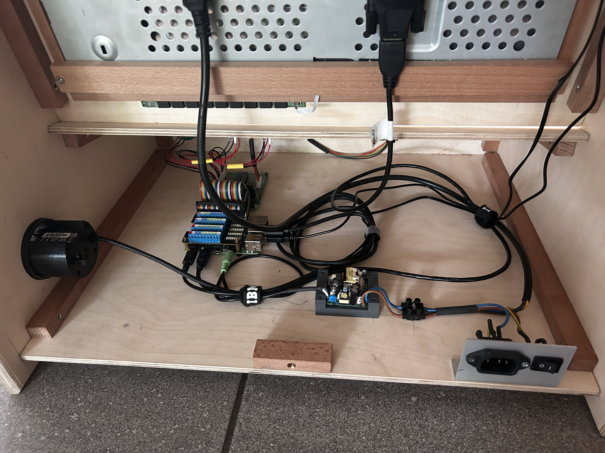

# CatchOrWaste: Java Game Application for Raspberry Pi Using FXGL

[](https://github.com/Pi4J/pi4j-example-fxgl/actions/workflows/maven.yml)


## Table of Contents

- [Project Overview](#project-overview)
- [Runtime Dependencies](#runtime-dependencies)
- [Build Dependencies & Instructions](#build-dependencies--instructions)
- [Setup New Raspberry Pi](#setup-new-raspberry-pi)
- [Install on Raspberry Pi](#install-on-raspberry-pi)
- [Game Modifications](#game-modifications)
- [Hardware](#hardware)
- [License](#license)

## Project Overview

This game was developed as part of a project at the University of Northwestern Switzerland ([FHNW](https://www.fhnw.ch/de/)) for the energy company [Primeo](https://www.primeo-energie.ch/privatkunden.html). It is an arcade game programmed in Java aimed at educating children and young people about the throwaway society.


## Runtime Dependencies

This project uses Pi4J V.2, which requires the following runtime dependencies:

- [**SLF4J (API)**](https://www.slf4j.org/)
- [**SLF4J-SIMPLE**](https://www.slf4j.org/)
- [**PIGPIO Library**](http://abyz.me.uk/rpi/pigpio) (for the Raspberry Pi) - This library is pre-installed on recent Raspbian images, but can also be manually installed using the instructions found [here](http://abyz.me.uk/rpi/pigpio/download.html).

This application also utilizes a JavaFX user interface, fully detailed in the [User Interface with JavaFX](https://v2.pi4j.com/getting-started/user-interface-with-javafx/) documentation.

## Build Dependencies & Instructions

To build this project, you need [Apache Maven](https://maven.apache.org/) 3.6 or later and Java 11 OpenJDK or later. Ensure these prerequisites are installed before proceeding. Use the following Maven command to clean previous builds and package the project:

```
mvn clean package
```

## Setup New Raspberry Pi

To set up a new Raspberry Pi, follow this guide: [Pi4J setup new Raspberry Pi](https://pi4j.com/getting-started/set-up-a-new-raspberry-pi/). Set the resolution of the monitor in the `monitors.xml` file to 800x600 for optimal performance and fullscreen.

## Install on Raspberry Pi

The game is pre-installed on the Pi. However, if you need to re-install the game, follow these instructions:

### Install Manually

1. Copy the compiled code (target) to your Raspberry Pi in `/home/pi4j/deploy`.
2. To manually run the application on the Raspberry Pi, execute the start-app.sh script:

```
sudo ./start-app.sh
```

3. To enable the application to start automatically after a boot or reboot, run the install-service.sh script:

```
sudo ./install-service.sh
```

### Install via Run Configuration

You'll need:

- A Java IDE (like IntelliJ)
- Network connection

Ensure your local machine is connected to the same network as your Raspberry Pi, then follow these steps:

1. Configure the IP address in the pom.xml file.
2. Select the Run on Pi.run.xml run configuration.
3. Execute the configuration. Upon a successful build, the new code will be transferred to the Pi (/home/pi4j/deploy), and the scripts will execute automatically, replacing any old project in this directory and setting up the service.

## Game Modifications

### Language and Text

Languages can be configured by the user via the options screen. This changes all text labels within all screens. The new language is applied as soon as the submit button at the end of the settings screen is pressed.
To change any text messages, edit the language JSON files in `/home/pi4j/deploy`

### Configurable Variables

These can be edited in the configurableVariables.json file located in `/home/pi4j/deploy`.
- Difficulty level (items per second and drop speed)
- Points per item for the three different types
- Total game time

### General Structure

The project is structured according to the MVC (Model-View-Controller) concept. For each screen, the timer, the scoring system, and the three entity types, there are:

- **Controller class:** Holds the logic for the game object. Structural methods can be found here.
- **Model class:** Holds data regarding the game object. Getter and setter methods can be found here.
- **View class:** Contains visualizations for each game object. Visuals can be found here.

To make changes, identify the corresponding game object affected and apply the MVC concept to choose the correct class to modify.

## Hardware

[Dimension Plan](assets%2Fpdf%2Fdimension_plan_arcade_box.pdf)

### Components

| Component                                   | Quantity | Technical Sheet                                                                           |
|---------------------------------------------|----------|-------------------------------------------------------------------------------------------|
| Arcade Joystick, 8 Ways, 65.3mm height, red | 1        | [Technical sheet](assets%2Fpdf%2FArcade-Joystick-8-Wege-65-3mm-Hoehe-rot.pdf)             |
| Arcade Button, 30mm, LED 5V DC, transparent | 3        | [Technical sheet](assets%2Fpdf%2FArcade-Button-30mm-beleuchtet-LED-5V-DC-transparent.pdf) |
| EIZO FlexScan 19” (48cm)                    | 1        | [Technical sheet](assets%2Fpdf%2Feizo_l768_datenblatt.pdf)                                |
| Raspberry Pi                                | 1        | [Technical sheet](assets%2Fpdf%2Fraspberry-pi-4-reduced-schematics.pdf)                   |

#### Monitor

- Removed from original housing and integrated into the box
- Settings bar attached inside the box
- Connected via HDMI to Raspberry Pi
- Power supply connected from the main power supply


#### Speakers

- Removed from original housing and integrated into the box
- Connected via stereo audio aux 3.5 mm to Raspberry Pi
- Power supply connected to Raspberry Pi (USB 3.1)
- Volume can be changed at the front of the box or headphones can be plugged in


#### Joystick & Buttons (Input)

- Connected via perforated circuit board to Raspberry Pi
- 10 kOhm resistance between each GPIO input and 3.3V+
- Perforated circuit board connected to Raspberry Pi with flat multi-cable


### Wiring




### Modifications

- Ensure the box is not powered when making any changes to the hardware.
- Simply unscrew the three screws at the back to open it.


## License

This project is licensed under the Apache License, Version 2.0. You may not use this file except in compliance with the License, which you can find at:
http://www.apache.org/licenses/LICENSE-2.0

Software distributed under the License is distributed on an "AS IS" BASIS, WITHOUT WARRANTIES OR CONDITIONS OF ANY KIND, either express or implied. Refer to the License for the specific language governing permissions and limitations under the License.
